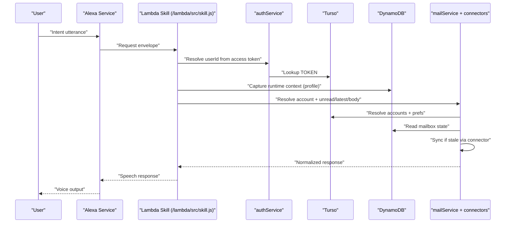
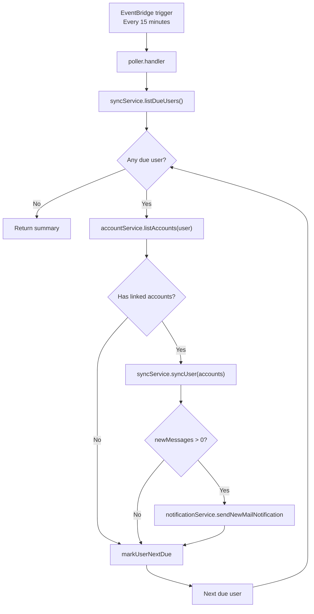
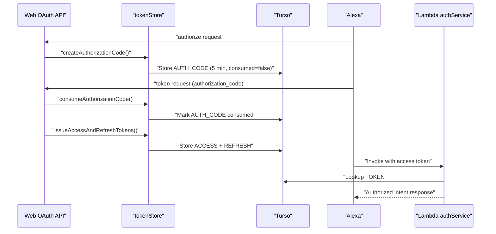

# INFO.md

Internal engineering and support handbook for the Email Reader Alexa Skill project.

Repository root: `/Users/subhajitrouy/Documents/Alexa/EmailReader`

## 1. Purpose and Audience

This handbook is for:
1. Developers implementing or extending functionality.
2. Support engineers handling user and integration issues.
3. On-call engineers triaging incidents in production.

Primary goals:
1. Explain what each module does and how data flows through the system.
2. Provide exact troubleshooting paths for common and high-impact failures.
3. Document operational and release expectations without requiring code spelunking.

## 2. Current System Architecture

### 2.1 Component summary

1. Alexa skill runtime:
   - Entry: `/Users/subhajitrouy/Documents/Alexa/EmailReader/lambda/index.js`
   - Builder: `/Users/subhajitrouy/Documents/Alexa/EmailReader/lambda/src/skill.js`
2. Poller runtime:
   - `/Users/subhajitrouy/Documents/Alexa/EmailReader/lambda/src/jobs/poller.js`
3. Web app:
   - `/Users/subhajitrouy/Documents/Alexa/EmailReader/web`
4. Storage:
   - Turso (`entities`) for shared accounts/tokens/prefs
   - DynamoDB for Alexa-internal profile/mailbox/runtime-secrets
5. External providers:
   - Gmail API
   - Microsoft Graph
   - IMAP servers
   - POP servers
6. Alexa APIs:
   - skill request/response
   - Notifications API

### 2.2 Request path diagram (Alexa -> Lambda)



## 3. Codebase Map by Directory and Responsibility

### 3.1 Top-level map

| Path | Responsibility |
|---|---|
| `/Users/subhajitrouy/Documents/Alexa/EmailReader/lambda` | Alexa runtime, connectors, poller, storage/service layers. |
| `/Users/subhajitrouy/Documents/Alexa/EmailReader/web` | Account linking web app, OAuth endpoints, mailbox admin UI. |
| `/Users/subhajitrouy/Documents/Alexa/EmailReader/skill-package` | Alexa interaction model and manifest. |
| `/Users/subhajitrouy/Documents/Alexa/EmailReader/infra` | CloudFormation template scaffold. |
| `/Users/subhajitrouy/Documents/Alexa/EmailReader/docs` | Operator-facing deployment/architecture summaries. |

### 3.2 Module-level ownership and behavior

#### Lambda skill and job orchestration

| File | Responsibility | Key behavior |
|---|---|---|
| `/Users/subhajitrouy/Documents/Alexa/EmailReader/lambda/src/skill.js` | Builds Alexa handler chain | Runtime interceptor resolves user, captures locale/notification context, routes intents. |
| `/Users/subhajitrouy/Documents/Alexa/EmailReader/lambda/src/jobs/poller.js` | Scheduled poller | Finds due users, syncs accounts, sends notifications, advances `nextDueAt`. |

#### Lambda service layer

| File | Responsibility | Key behavior |
|---|---|---|
| `/Users/subhajitrouy/Documents/Alexa/EmailReader/lambda/src/services/accountService.js` | Account resolution/prefs | Label matching, default account, polling normalization (15/30/60), runtime profile capture. |
| `/Users/subhajitrouy/Documents/Alexa/EmailReader/lambda/src/services/mailService.js` | Voice-facing mailbox API | Delegates to `syncService`, applies message limit/index logic. |
| `/Users/subhajitrouy/Documents/Alexa/EmailReader/lambda/src/services/syncService.js` | Sync engine | Calls connectors, compares message IDs, caches mailbox state, identifies new messages. |
| `/Users/subhajitrouy/Documents/Alexa/EmailReader/lambda/src/services/notificationService.js` | Alexa notifications | Posts `v1/notifications` using runtime endpoint + API token from profile. |
| `/Users/subhajitrouy/Documents/Alexa/EmailReader/lambda/src/services/authService.js` | Access-token identity | Hashes incoming access token and resolves user from `ACCESS` token record. |
| `/Users/subhajitrouy/Documents/Alexa/EmailReader/lambda/src/services/oauthRefreshService.js` | Provider refresh token flow | Refreshes Gmail/Outlook access tokens and persists updated encrypted credentials. |

#### Lambda connectors

| File | Responsibility | Key behavior |
|---|---|---|
| `/Users/subhajitrouy/Documents/Alexa/EmailReader/lambda/src/connectors/gmailConnector.js` | Gmail mailbox access | Uses Gmail API, reads unread via search, fetches full message payloads. |
| `/Users/subhajitrouy/Documents/Alexa/EmailReader/lambda/src/connectors/outlookConnector.js` | Outlook mailbox access | Uses Graph inbox endpoints, unread item count from folder metadata. |
| `/Users/subhajitrouy/Documents/Alexa/EmailReader/lambda/src/connectors/imapConnector.js` | IMAP mailbox access | Uses `imapflow`, lock inbox, fetches recent range and unseen status. |
| `/Users/subhajitrouy/Documents/Alexa/EmailReader/lambda/src/connectors/popConnector.js` | POP mailbox access | Raw POP command flow, UIDL history-based unread approximation. |
| `/Users/subhajitrouy/Documents/Alexa/EmailReader/lambda/src/connectors/index.js` | Provider dispatch | Maps provider string to connector implementation. |

#### Lambda store/security/utils

| File | Responsibility | Key behavior |
|---|---|---|
| `/Users/subhajitrouy/Documents/Alexa/EmailReader/lambda/src/store/repository.js` | Hybrid storage API | DynamoDB for profile/mailbox, Turso for accounts/prefs/tokens/due-user scan. |
| `/Users/subhajitrouy/Documents/Alexa/EmailReader/lambda/src/store/keyBuilder.js` | Key conventions | `USER#...`, `ACCOUNT#...`, `MAILBOX#...`, `TOKEN#...`. |
| `/Users/subhajitrouy/Documents/Alexa/EmailReader/lambda/src/security/cryptoService.js` | Encryption/decryption | KMS envelope preferred; AES-GCM fallback via env or runtime secret map; plaintext-base64 fallback. |
| `/Users/subhajitrouy/Documents/Alexa/EmailReader/lambda/src/utils/*` | Parsing/text/hash helpers | Message parsing, clipping/HTML strip, SHA-256 token hashing. |

#### Web API layer

| Path pattern | Responsibility | Notes |
|---|---|---|
| `/Users/subhajitrouy/Documents/Alexa/EmailReader/web/app/api/alexa/oauth/*` | Alexa account-linking OAuth endpoints | `authorize`, `token`, `revoke`. |
| `/Users/subhajitrouy/Documents/Alexa/EmailReader/web/app/api/providers/*` | Provider OAuth start/callback | Google + Microsoft connect flows. |
| `/Users/subhajitrouy/Documents/Alexa/EmailReader/web/app/api/accounts/*` | Account management POST routes | Manual account add, polling update, default account set. |
| `/Users/subhajitrouy/Documents/Alexa/EmailReader/web/app/api/session/*` | Session management | Sign in/out with CSRF checks. |

#### Web library layer

| File | Responsibility | Key behavior |
|---|---|---|
| `/Users/subhajitrouy/Documents/Alexa/EmailReader/web/lib/config.js` | Runtime config | Environment resolution and defaults. |
| `/Users/subhajitrouy/Documents/Alexa/EmailReader/web/lib/security.js` | Signing/hash/encryption | HMAC for state/session, token hash, AES-GCM/plaintext fallback encryption. |
| `/Users/subhajitrouy/Documents/Alexa/EmailReader/web/lib/session.js` | Session cookie logic | Signed 30-day session token (`email_reader_session`). |
| `/Users/subhajitrouy/Documents/Alexa/EmailReader/web/lib/csrf.js` | CSRF protections | Issued token cookie + request validation. |
| `/Users/subhajitrouy/Documents/Alexa/EmailReader/web/lib/tokenStore.js` | OAuth token lifecycle | Create/consume auth codes, issue/refresh/revoke tokens. |
| `/Users/subhajitrouy/Documents/Alexa/EmailReader/web/lib/accounts.js` | Linked account operations | Max account guard, encrypted credential persistence. |
| `/Users/subhajitrouy/Documents/Alexa/EmailReader/web/lib/providerOAuth.js` | Provider exchange logic | OAuth URL creation and token/profile exchange. |
| `/Users/subhajitrouy/Documents/Alexa/EmailReader/web/lib/store.js` | Web-side Turso wrapper | Profile/account/prefs/token CRUD in `entities` table. |
| `/Users/subhajitrouy/Documents/Alexa/EmailReader/web/lib/oauthState.js` | OAuth state signing | 10-minute signed state payload for provider callbacks. |

## 4. Lambda Request Lifecycle

1. Alexa invokes Lambda handler in `/Users/subhajitrouy/Documents/Alexa/EmailReader/lambda/index.js`.
2. `RuntimeContextInterceptor` in `/Users/subhajitrouy/Documents/Alexa/EmailReader/lambda/src/skill.js`:
   - reads Alexa `accessToken`
   - resolves user via `authService.resolveUserIdFromAccessToken`
   - captures locale + notification permission + API endpoint/token into profile
3. Request is routed to intent handlers in:
   - `/Users/subhajitrouy/Documents/Alexa/EmailReader/lambda/src/handlers/systemHandlers.js`
   - `/Users/subhajitrouy/Documents/Alexa/EmailReader/lambda/src/handlers/customIntentHandlers.js`
4. Custom handlers call service layer:
   - `accountService`
   - `mailService`
5. `mailService` uses `syncService.syncIfStale` for freshness:
   - stale threshold default `5` minutes
6. Connector fetches provider data and returns normalized messages.
7. Response builder emits Alexa speech response.

Expected state:
1. `USER_PROFILE` updated with runtime context when user is authenticated.
2. `MAILBOX_STATE` updated after stale sync.

## 5. Poller Lifecycle

Polling/new-mail pipeline:



Detailed sequence:
1. Poller scans `USER_PREFS` with `nextDueAt <= now`.
2. For each due user:
   - list active accounts
   - sync each account
   - detect new messages by message ID delta
   - send notifications for accounts with new messages
   - advance `nextDueAt`
3. Returns summary object:
   - `scannedUsers`
   - `syncedUsers`
   - `notificationsSent`
   - `errors[]`

## 6. Data Model and Hybrid Storage Strategy

Key scheme in `/Users/subhajitrouy/Documents/Alexa/EmailReader/lambda/src/store/keyBuilder.js`:
1. `PK = USER#<userId>` for user-scoped entities.
2. `SK = PROFILE` for user profile.
3. `SK = PREFS` for polling/default account prefs.
4. `SK = ACCOUNT#<accountId>` for linked accounts.
5. `SK = MAILBOX#<accountId>` for cached mailbox state.
6. `PK = TOKEN#<sha256(token)>`, `SK = ACCESS|REFRESH|AUTH_CODE` for OAuth records.

Storage placement:
1. Turso `entities` table:
   - `USER_PREFS`
   - `LINKED_ACCOUNT`
   - `OAUTH_TOKEN`
2. DynamoDB:
   - `USER_PROFILE`
   - `MAILBOX_STATE`
   - runtime secret map item (`SYSTEM#SECRETS` / `RUNTIME#PRIMARY` by default)

Entity overview:

| Entity | PK/SK | Required fields |
|---|---|---|
| `USER_PROFILE` | `USER#id / PROFILE` | `userId`, `locale`, notification context fields, timestamps. |
| `USER_PREFS` | `USER#id / PREFS` | `pollingMinutes`, `nextDueAt`, `activeAccountId` optional. |
| `LINKED_ACCOUNT` | `USER#id / ACCOUNT#id` | `provider`, `label`, `authType`, `credentialsBlob`, `status`. |
| `MAILBOX_STATE` | `USER#id / MAILBOX#id` | `unreadCount`, `messages[]`, `lastSyncAt`, `seenUids` (POP). |
| `OAUTH_TOKEN` | `TOKEN#hash / type` | `userId`, `clientId`, `scope`, `expiresAt`, status flags. |

Core internal shape reference:

| Type | Fields |
|---|---|
| `LinkedAccount` | `accountId`, `provider`, `label`, `authType`, `status`, `credentialsBlob`, `lastSyncAt`. |
| `EmailMessage` | `id`, `from`, `subject`, `snippet`, `bodyText`, `receivedAt`, `isUnread`. |
| `UserPrefs` | `pollingMinutes`, `nextDueAt`, `activeAccountId`. |

## 7. OAuth and Session Model

OAuth/token lifecycle:



Model details:
1. Alexa OAuth endpoints:
   - `GET /api/alexa/oauth/authorize`
   - `POST /api/alexa/oauth/token`
   - `POST /api/alexa/oauth/revoke`
2. `authorize` checks:
   - client ID match
   - response type `code`
   - redirect URI allows `https` Amazon domains or localhost
3. `token` grant types:
   - `authorization_code`
   - `refresh_token`
4. Token storage:
   - token plaintext never used as key
   - hash used as partition key (`TOKEN#<sha256>`)
5. Session model:
   - signed cookie `email_reader_session`
   - 30-day expiration
6. CSRF model:
   - signed cookie `email_reader_csrf`
   - form token required for POST actions

## 8. Security Model

Implemented controls:
1. Credentials/token blobs encrypted at rest:
   - KMS envelope (preferred)
   - AES-GCM with app key fallback
2. OAuth state integrity:
   - HMAC-signed `state` payload with expiration
3. Session integrity:
   - HMAC-signed session payload
4. CSRF checks for form-based POST routes.
5. OAuth client validation on token endpoint.
6. Token lookup uses SHA-256 hash instead of plaintext keying.

Current risks (as-is):
1. If no `KMS_KEY_ID` and no `APP_ENCRYPTION_KEY`, encryption falls back to `plaintext-base64`.
2. Poller due-user lookup uses table scan; large-scale workloads may degrade.
3. Session cookie uses `secure: true`; local HTTP testing requires HTTPS proxy or adjustment.
4. No centralized secret rotation workflow currently documented in code.

## 9. Connector Internals

### 9.1 Gmail connector

File: `/Users/subhajitrouy/Documents/Alexa/EmailReader/lambda/src/connectors/gmailConnector.js`

Behavior:
1. Resolves access token (from context refresh service when available).
2. Unread count query: `messages?q=is:unread&labelIds=INBOX`.
3. Recent messages:
   - list message IDs
   - fetch each message detail (`format=full`)
   - parse headers and first available text/plain body
4. Normalization:
   - snippet clipped to 180 chars
   - body clipped to 8000 chars

### 9.2 Outlook connector

File: `/Users/subhajitrouy/Documents/Alexa/EmailReader/lambda/src/connectors/outlookConnector.js`

Behavior:
1. Uses Graph folder endpoint for unread count.
2. Fetches latest messages ordered by `receivedDateTime desc`.
3. Prefers text body using `Prefer: outlook.body-content-type="text"`.
4. Normalizes `from/subject/snippet/body` fields.

### 9.3 IMAP connector

File: `/Users/subhajitrouy/Documents/Alexa/EmailReader/lambda/src/connectors/imapConnector.js`

Behavior:
1. Connects via `imapflow` using host/port/auth.
2. Locks `INBOX` during operations.
3. Unread from `status('INBOX', { unseen: true })`.
4. Recent messages fetched by range and normalized.

### 9.4 POP connector

File: `/Users/subhajitrouy/Documents/Alexa/EmailReader/lambda/src/connectors/popConnector.js`

Behavior:
1. Implements POP commands over `net/tls` sockets (`USER`, `PASS`, `STAT`, `UIDL`, `TOP/RETR`, `QUIT`).
2. Builds UID map and latest message list.
3. Uses prior `seenUids` mailbox state for unread approximation.
4. Stores snapshot context (`messages`, `unreadCount`, `seenUids`).

## 10. Intent Handlers and Conversation Logic

### 10.1 Custom intents

Source: `/Users/subhajitrouy/Documents/Alexa/EmailReader/lambda/src/handlers/customIntentHandlers.js`

| Intent | Primary behavior | Failure/edge behavior |
|---|---|---|
| `GetUnreadCountIntent` | Resolve account and speak unread count. | If no linked account, prompts user to web app. |
| `ReadLatestEmailsIntent` | Resolve account and read list with index prompts. | If no messages, says none found. |
| `ReadEmailBodyIntent` | Read full body by index. | If index missing/invalid, defaults to first; missing message returns guidance. |
| `ListLinkedAccountsIntent` | List labels/providers for active accounts. | If none, prompts to connect. |
| `SwitchAccountIntent` | Set active default account by label matching. | Unknown label prompts to list accounts first. |
| `SetPollingIntervalIntent` | Update polling preference. | Normalizes values to 15/30/60. |

### 10.2 System intents

Source: `/Users/subhajitrouy/Documents/Alexa/EmailReader/lambda/src/handlers/systemHandlers.js`

1. Launch:
   - unauthenticated: link-account prompt
   - authenticated: attempts unread summary
2. Help:
   - describes available commands
3. AccountLinkingHelp:
   - explicit linking instructions + account card
4. Cancel/Stop/Fallback/Error:
   - standard voice control/error handling

## 11. Configuration Matrix and Env Variable Semantics

### 11.1 Lambda config semantics (`/lambda/src/config.js`)

| Variable | Effect if missing |
|---|---|
| `EMAIL_READER_TABLE` | Defaults to `EmailReader`. |
| `ALEXA_SECRET_TABLE` | Falls back to `EMAIL_READER_TABLE`. |
| `ALEXA_SECRET_PK` | Defaults to `SYSTEM#SECRETS`. |
| `ALEXA_SECRET_SK` | Defaults to `RUNTIME#PRIMARY`. |
| `ALEXA_SECRET_ID_KEY` | Defaults to `id` for id-only key schema tables. |
| `ALEXA_SECRET_ID` | Defaults to `SYSTEM#SECRETS#RUNTIME#PRIMARY` for id-only key schema tables. |
| `ALEXA_SECRET_CACHE_SECONDS` | Defaults to `300`. |
| `DEFAULT_POLLING_MINUTES` | Defaults to `15`. |
| `MAX_LINKED_ACCOUNTS` | Defaults to `3`. |
| `MAX_CACHED_MESSAGES` | Defaults to `10`. |
| `STALE_SYNC_MINUTES` | Defaults to `5`. |
| `KMS_KEY_ID` | KMS encryption path disabled. |
| `APP_ENCRYPTION_KEY` | AES-GCM fallback can still come from DynamoDB secret map. |
| `NOTIFICATIONS_ENABLED` | Treated as enabled unless set to `'false'`. |
| OAuth provider client keys | Refresh flows fail if missing in both env and secret map. |

### 11.2 Web config semantics (`/web/lib/config.js`)

| Variable | Effect if missing |
|---|---|
| `SESSION_SECRET` | Uses weak placeholder; must override in production. |
| `CSRF_SECRET` | Uses weak placeholder; must override in production. |
| `ALEXA_OAUTH_CLIENT_SECRET` | Uses weak placeholder; token endpoint still validates against it. |
| `TURSO_DATABASE_URL` | Web data routes fail because Turso connection cannot initialize. |
| `TURSO_AUTH_TOKEN` | Remote Turso auth fails for non-local databases. |
| Provider OAuth vars | Connect routes fail with explicit errors. |
| `APP_BASE_URL` | Defaults to `http://localhost:3000`; breaks remote OAuth if not overridden. |

## 12. Operational Runbook

### 12.1 Daily/shift checks

1. Verify web app route health:
   - `/signin`
   - `/dashboard`
2. Verify Lambda invocation health in CloudWatch logs.
3. Verify poller invocations at expected cadence (15 minutes).
4. Spot-check notification send outcomes (`sent` vs failure reasons).

Expected state:
1. No sustained spike in error logs.
2. Poller summary shows regular scans.
3. Token endpoint requests not failing with persistent `invalid_client`.

### 12.2 Pre-release checks

1. Run local tests:
```bash
cd /Users/subhajitrouy/Documents/Alexa/EmailReader/lambda && npm test && npm run build
cd /Users/subhajitrouy/Documents/Alexa/EmailReader/web && npm test && npm run build
```
2. Validate skill model in Alexa console.
3. Execute smoke utterances on a linked test account.

Expected state:
1. All tests/builds pass.
2. Skill model builds with no blocking validation errors.
3. End-to-end account linking and unread command succeed.

### 12.3 Post-release checks

1. Confirm traffic reaches new deploy (web + lambda logs).
2. Confirm at least one successful unread command.
3. Confirm at least one poller cycle completes with no fatal errors.
4. Confirm no immediate notification regression.

## 13. Incident Playbooks

Each playbook includes:
1. Symptom.
2. Likely causes.
3. Validation commands/checks.
4. Immediate mitigation.
5. Durable fix.
6. Post-incident notes.

### 13.1 Incident: Alexa account linking broken

Symptom:
1. Users cannot complete linking; Alexa reports account linking error.

Likely causes:
1. Mismatch between skill manifest URLs and deployed web domain.
2. Client ID/secret mismatch.
3. Redirect URI rejected by `isAllowedRedirectUri`.

Validation:
1. Inspect skill manifest in `/Users/subhajitrouy/Documents/Alexa/EmailReader/skill-package/skill.json`.
2. Validate web env vars for `ALEXA_OAUTH_CLIENT_ID` and `ALEXA_OAUTH_CLIENT_SECRET`.
3. Check web logs for `invalid_client`, `invalid_redirect_uri`, `unsupported_response_type`.
4. Run quick endpoint checks:

```bash
curl -i \"https://<VERCEL_DOMAIN>/api/alexa/oauth/authorize?client_id=email-reader-alexa&response_type=code&redirect_uri=https://layla.amazon.com/api/skill/link/M2&state=test\"
curl -i -X POST \"https://<VERCEL_DOMAIN>/api/alexa/oauth/token\" \\
  -H \"Authorization: Basic <BASE64(email-reader-alexa:<ALEXA_CLIENT_SECRET>)>\" \\
  -H \"Content-Type: application/x-www-form-urlencoded\" \\
  --data \"grant_type=authorization_code&code=<AUTH_CODE>&redirect_uri=https://layla.amazon.com/api/skill/link/M2\"
```

Immediate mitigation:
1. Revert to known-good client credentials.
2. Restore known-good account linking URLs.

Durable fix:
1. Add release checklist gate for account-linking config parity.
2. Add synthetic test hitting authorize and token endpoints pre-release.

Post-incident notes:
1. Record exact failing request params and error payloads.

Decision tree:
1. If error is `invalid_client`, verify secrets first.
2. If error is `invalid_redirect_uri`, verify Alexa redirect URL and allowlist logic.
3. If no web logs appear, verify DNS/deployment routing.

### 13.2 Incident: OAuth token refresh failures

Symptom:
1. Gmail/Outlook unread fetch begins failing after tokens expire.

Likely causes:
1. Missing provider client credentials.
2. Revoked refresh token.
3. Provider token endpoint outage or policy change.

Validation:
1. Check Lambda logs for `Failed to refresh <provider> token`.
2. Verify `GOOGLE_*` and `MICROSOFT_*` vars on Lambda.
3. Confirm account credentials include `refreshToken`.
4. Pull recent Lambda errors:

```bash
aws logs tail \"/aws/lambda/<EMAIL_READER_SKILL_FUNCTION>\" --since 2h --follow
```

Immediate mitigation:
1. Prompt user to re-link provider account.
2. Temporarily disable affected provider in support communication.

Durable fix:
1. Add refresh-failure counters and alerting.
2. Implement auto-marking account status as reconnect-required.

Post-incident notes:
1. Capture provider status page and timestamps.

Decision tree:
1. If only one user is impacted, likely revoked token.
2. If many users same provider impacted simultaneously, likely env/config or provider outage.

### 13.3 Incident: DynamoDB read/write failures

Symptom:
1. Skill errors, poller cannot persist mailbox/profile state, or runtime secret lookup fails.

Likely causes:
1. IAM policy regression.
2. Table name misconfiguration.
3. Regional mismatch.

Validation:
1. Check Lambda logs for AWS SDK errors.
2. Confirm env vars:
   - `EMAIL_READER_TABLE`
   - `AWS_REGION`
   - `ALEXA_SECRET_TABLE` (if overridden)
   - `ALEXA_SECRET_PK`
   - `ALEXA_SECRET_SK`
   - `ALEXA_SECRET_ID_KEY` (for id-only tables)
   - `ALEXA_SECRET_ID` (for id-only tables)
3. Confirm IAM role has `dynamodb:GetItem|PutItem|Query|Scan`.
4. Validate table access with AWS CLI:

```bash
aws dynamodb describe-table --table-name EmailReader --region <AWS_REGION>
```

Immediate mitigation:
1. Roll back to previous IAM/policy if recent change occurred.
2. Correct env vars and redeploy.

Durable fix:
1. Add deployment validation step for table access.
2. Add canary read/write startup health check.

Post-incident notes:
1. Record exact AWS error code and impacted entity type.

Decision tree:
1. If all routes fail, check region/table env first.
2. If only writes fail, check IAM write permissions.
3. If only poller fails, check poller role separately.

### 13.4 Incident: Poller running but no notifications

Symptom:
1. Poller executes but users report no Alexa alerts.

Likely causes:
1. `notificationPermission` not `GRANTED` in profile.
2. Missing `apiEndpoint` / `apiAccessToken` in profile (user has not invoked skill recently).
3. No net-new messages detected by ID diff.
4. Notifications API errors from Alexa endpoint.

Validation:
1. Review poller summary and error entries.
2. Inspect profile record for notification fields.
3. Check `sendNewMailNotification` return reasons:
   - `permission-not-granted`
   - `missing-runtime-endpoint`
   - `notification-api-<status>`
4. Pull poller logs:

```bash
aws logs tail \"/aws/lambda/<EMAIL_READER_POLLER_FUNCTION>\" --since 2h --follow
```

Immediate mitigation:
1. Ask user to open skill once and re-grant permissions.
2. Trigger manual test email and wait one poll interval.

Durable fix:
1. Add automated reminder when profile lacks runtime endpoint.
2. Add notification-delivery metrics/alerts.

Post-incident notes:
1. Record whether notification permission/regeneration solved issue.

Decision tree:
1. If reason is permission-related, user action required.
2. If reason is endpoint-related, invoke skill to refresh profile context.
3. If reason is API status, inspect upstream response body and service health.

### 13.5 Incident: Provider API rate-limit or auth errors

Symptom:
1. Sync failures for one provider with HTTP 401/403/429 patterns.

Likely causes:
1. Expired/invalid tokens.
2. Missing scopes.
3. Provider rate limiting.

Validation:
1. Check connector errors in Lambda logs:
   - `Gmail API <status>`
   - `Microsoft Graph <status>`
2. Confirm scopes configured in provider auth consent.
3. Verify per-user call spikes if rate-limited.
4. Pull skill Lambda logs for provider failures:

```bash
aws logs tail \"/aws/lambda/<EMAIL_READER_SKILL_FUNCTION>\" --since 2h --follow
```

Immediate mitigation:
1. Re-link affected accounts if auth broken.
2. Temporarily reduce aggressive retries/manual re-asks.

Durable fix:
1. Add backoff and provider-specific retry policy.
2. Add rate-limit aware connector wrappers.

Post-incident notes:
1. Track provider status references and exact status/body patterns.

Decision tree:
1. `401/403`: treat as auth/scope issue first.
2. `429`: treat as rate-limit issue, add throttling/backoff.
3. Mixed statuses across users: inspect token freshness and provider outages.

## 14. Logging and Diagnostics Guide

### 14.1 Critical log surfaces

1. Lambda skill logs:
   - intent failures
   - token resolution failures
   - connector exceptions
2. Poller logs:
   - cycle summary (`scannedUsers`, `syncedUsers`, `notificationsSent`, `errors`)
3. Web logs:
   - OAuth endpoint errors
   - CSRF/session errors
   - provider callback exceptions

### 14.2 Diagnostic checklist by symptom

1. Auth symptom:
   - check `/api/alexa/oauth/token` error payload.
2. Voice symptom:
   - check Lambda error handler output and intent branch reached.
3. Data symptom:
   - inspect DynamoDB items for user/account/mailbox consistency.
4. Polling symptom:
   - verify `USER_PREFS.nextDueAt` progression.

### 14.3 Useful local commands

```bash
cd /Users/subhajitrouy/Documents/Alexa/EmailReader/lambda && npm test
cd /Users/subhajitrouy/Documents/Alexa/EmailReader/web && npm test
cd /Users/subhajitrouy/Documents/Alexa/EmailReader/web && npm run build
```

Expected output:
1. All tests pass.
2. Web build succeeds.

## 15. Testing Strategy and Gaps

### 15.1 Current implemented tests

Lambda tests:
1. `/Users/subhajitrouy/Documents/Alexa/EmailReader/lambda/tests/accountService.test.js`
2. `/Users/subhajitrouy/Documents/Alexa/EmailReader/lambda/tests/authService.test.js`
3. `/Users/subhajitrouy/Documents/Alexa/EmailReader/lambda/tests/syncService.test.js`
4. `/Users/subhajitrouy/Documents/Alexa/EmailReader/lambda/tests/tokenHash.test.js`

Web tests:
1. `/Users/subhajitrouy/Documents/Alexa/EmailReader/web/tests/security.test.js`
2. `/Users/subhajitrouy/Documents/Alexa/EmailReader/web/tests/tokenStore.test.js`

### 15.2 Coverage strengths

1. Polling interval normalization logic.
2. Token hash and auth token resolution.
3. Token lifecycle basics.
4. Signed value verification utilities.

### 15.3 Gaps

1. No full integration tests across OAuth + Alexa linking.
2. No connector contract tests with mocked provider APIs.
3. No end-to-end notification path tests.
4. No load/scalability tests for due-user scan behavior.

Recommended additions:
1. Integration test harness for web OAuth endpoints.
2. Contract tests for connector normalization.
3. Poller dry-run test with fixture table data.

## 16. Extension Guide

### 16.1 Add a new email provider

1. Create connector in `/Users/subhajitrouy/Documents/Alexa/EmailReader/lambda/src/connectors/`.
2. Export from `/Users/subhajitrouy/Documents/Alexa/EmailReader/lambda/src/connectors/index.js`.
3. Add provider auth/credential handling in web layer:
   - `/Users/subhajitrouy/Documents/Alexa/EmailReader/web/lib/providerOAuth.js` or manual forms.
4. Update documentation and tests.

Expected state:
1. Connector supports `getUnreadCount` and `getRecentMessages` returning normalized shape.
2. Account creation path writes valid `provider` + `credentialsBlob`.

### 16.2 Add new intent

1. Add intent schema and samples in `/Users/subhajitrouy/Documents/Alexa/EmailReader/skill-package/interactionModels/custom/en-US.json`.
2. Implement handler in `/Users/subhajitrouy/Documents/Alexa/EmailReader/lambda/src/handlers/customIntentHandlers.js`.
3. Register handler in `/Users/subhajitrouy/Documents/Alexa/EmailReader/lambda/src/skill.js`.
4. Add tests for behavior and slot parsing.

### 16.3 Add write/send-email capability

1. Define permission and policy boundaries first.
2. Add SMTP send service using stored SMTP settings.
3. Add explicit user confirmation voice flow before sending.
4. Add auditable logging and abuse protections.

## 17. Release and Rollback Procedure

### 17.1 Release

1. Run local checks:
```bash
cd /Users/subhajitrouy/Documents/Alexa/EmailReader/lambda && npm test && npm run build
cd /Users/subhajitrouy/Documents/Alexa/EmailReader/web && npm test && npm run build
```
2. Deploy web app.
3. Deploy Lambda(s).
4. Update/deploy skill package.
5. Run smoke checks from README section 15.

Expected state:
1. No critical runtime errors.
2. Account linking and unread flow succeed.

### 17.2 Rollback

1. Roll back Vercel deployment to previous known-good.
2. Roll back Lambda aliases/versions to previous known-good.
3. Re-apply previous skill package if model or account-linking config regressed.
4. Verify minimal smoke tests.

Expected state:
1. Link + unread flow restored.
2. Error rate returns to baseline.

## 18. Risk Register and Technical Debt

| Area | Current Risk | Impact | Priority |
|---|---|---|---|
| Encryption fallback | May run in plaintext-base64 mode if keys missing | High | High |
| Poller scalability | Due-user scan (`scan + filter`) can degrade at scale | Medium/High | High |
| Notification dependency | Requires recently captured runtime endpoint/token | Medium | Medium |
| POP unread model | Approximate unread semantics | Medium | Medium |
| Observability | No explicit metrics/alarms in code | Medium | Medium |
| OAuth hardening | Basic client validation, limited abuse controls | Medium | Medium |

Suggested debt backlog:
1. Enforce encryption key presence at startup.
2. Replace due-user scan with indexable schedule model.
3. Add CloudWatch metrics/alarms for poller and notifications.
4. Add integration tests for critical paths.

## 19. Appendix

### 19.1 Endpoint reference

Alexa OAuth endpoints:
1. `GET /api/alexa/oauth/authorize`
2. `POST /api/alexa/oauth/token`
3. `POST /api/alexa/oauth/revoke`

Provider routes:
1. `GET /api/providers/google/connect`
2. `GET /api/providers/google/callback`
3. `GET /api/providers/microsoft/connect`
4. `GET /api/providers/microsoft/callback`

Account/session routes:
1. `POST /api/session/login`
2. `POST /api/session/logout`
3. `POST /api/accounts/manual`
4. `POST /api/accounts/polling`
5. `POST /api/accounts/default`

### 19.2 Token endpoint example

Request:

```http
POST /api/alexa/oauth/token
Authorization: Basic <BASE64(email-reader-alexa:<ALEXA_CLIENT_SECRET>)>
Content-Type: application/x-www-form-urlencoded

grant_type=authorization_code&code=<AUTH_CODE>&redirect_uri=<ALEXA_REDIRECT_URI>
```

Success response shape:

```json
{
  "access_token": "<ACCESS_TOKEN>",
  "token_type": "Bearer",
  "expires_in": 3600,
  "refresh_token": "<REFRESH_TOKEN>",
  "scope": "profile"
}
```

### 19.3 Glossary

1. `AUTH_CODE`: short-lived authorization code exchanged for access token.
2. `ACCESS`: token used by Alexa to invoke skill as linked user.
3. `REFRESH`: token used to mint new access token via token endpoint.
4. `MAILBOX_STATE`: cached unread/messages snapshot per account.
5. `nextDueAt`: timestamp controlling when poller should sync user again.
6. `runtime endpoint token`: Alexa-provided API token used for notifications API calls.
