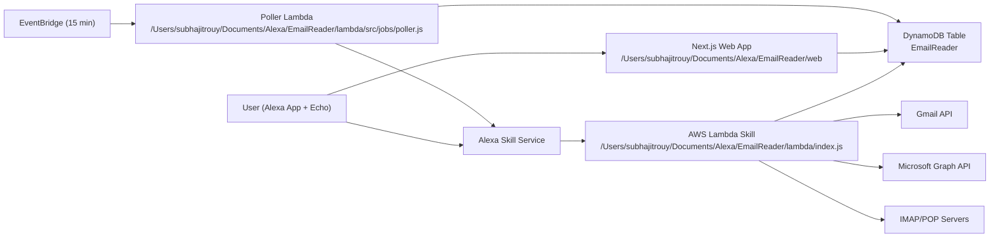
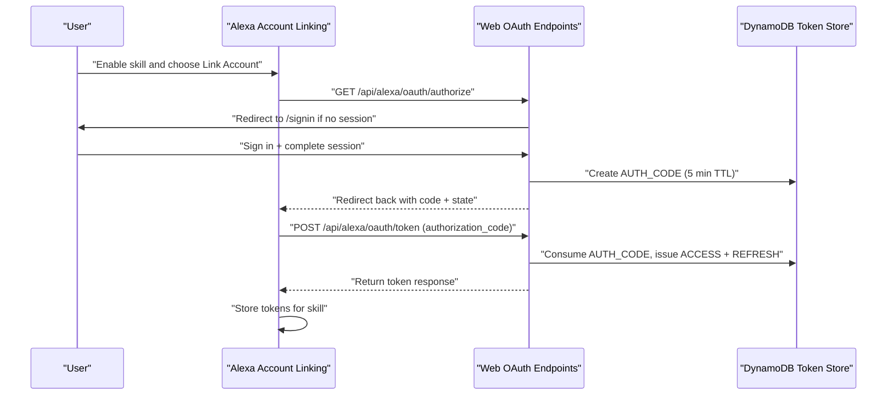

# Email Reader Alexa Skill

A complete Alexa custom skill + web companion that lets users connect email accounts, ask Alexa for unread counts and recent emails, and receive new-mail notifications.

This repository currently includes:
- Alexa runtime on AWS Lambda.
- Background polling job for new-mail detection.
- Next.js web app for sign-in, account linking, and mailbox preferences.
- Alexa skill package (manifest + interaction model).

## 1. Project Overview

`Email Reader` is designed for voice-first usage on Alexa devices, especially input-limited hardware (for example Echo devices). The user handles account linking and mailbox management in a web app, then uses voice commands through Alexa.

Core capabilities implemented:
1. Account linking through Alexa OAuth (`AUTH_CODE` grant).
2. Mailbox connection options:
   - Gmail OAuth
   - Outlook OAuth
   - Manual IMAP
   - Manual POP (unread approximation)
3. Voice flows:
   - unread count
   - latest email summaries
   - full-body readout by index
   - account switching
   - polling interval updates (15/30/60)
4. Notification flow:
   - background poller checks due users
   - new messages trigger Alexa Notifications API requests

## 2. Who This Is For

This README is written for:
1. End users who want to use the skill.
2. Deployers/operators who host the stack on AWS + Vercel.
3. Support engineers who need first-line troubleshooting.

For deep developer internals, use `/Users/subhajitrouy/Documents/Alexa/EmailReader/INFO.md`.
Deep link: [INFO.md](INFO.md)

## 3. What the Skill Does

When configured correctly, a user can:
1. Link the Alexa skill account in the Alexa app.
2. Sign in on the web portal.
3. Connect one or more mailbox accounts (up to configured limit, default 3).
4. Ask Alexa:
   - unread count for default or named account
   - latest emails (sender + subject + snippet)
   - full body for a selected email index
5. Receive Alexa notifications when new mail arrives (if permission is granted and poller is healthy).

## 4. Supported Providers and Protocol Behavior

| Mode | Auth | Read Unread Count | Read Latest Messages | Notes |
|---|---|---|---|---|
| Gmail | OAuth2 | Yes | Yes | Uses Gmail API (`gmail.readonly`). |
| Outlook | OAuth2 | Yes | Yes | Uses Microsoft Graph `Mail.Read`. |
| IMAP | Manual host/user/pass | Yes | Yes | Uses `imapflow`, reads from `INBOX`. |
| POP | Manual host/user/pass | Approximate | Yes | Unread approximation from UID history (`seenUids`). |
| SMTP | Manual settings storage | No | No | Stored for future extension only. |

## 5. End-User Prerequisites

A user needs:
1. Alexa account and Alexa app access.
2. Skill enabled in Alexa.
3. Connected mailbox credentials:
   - Gmail/Outlook OAuth consent, or
   - IMAP/POP server details + app password where required.
4. Notification permission granted for this skill if alerts are desired.

## 6. First-Time Setup (Operator + User Journey)

### 6.1 Operator setup overview

1. Deploy AWS resources and Lambda code.
2. Deploy web app to Vercel.
3. Configure Alexa skill account linking URLs to web app.
4. Validate smoke tests.

### 6.2 User setup overview

1. Open Alexa app, enable skill.
2. Tap `Link Account`.
3. Complete sign-in in web app.
4. Connect at least one mailbox.
5. Return to Alexa and test commands.

Expected state after first-time setup:
1. Alexa account linking completes without error.
2. Dashboard shows at least one linked account.
3. Voice command returns unread count.

## 7. Account Linking End-to-End Flow

High-level system map:



Account linking + token exchange sequence:



## 8. Web Dashboard Usage Guide

Dashboard path: `/dashboard` in deployed web app.

User actions:
1. Connect Gmail:
   - click `Connect Gmail`
   - consent OAuth
   - expect redirect to `/dashboard?connected=gmail`
2. Connect Outlook:
   - click `Connect Outlook`
   - consent OAuth
   - expect redirect to `/dashboard?connected=outlook`
3. Add manual IMAP/POP account:
   - fill label/provider/host/port/username/password
   - optional SMTP fields
   - submit form
   - expect redirect to `/dashboard?saved=manual`
4. Set default account:
   - click `Set as default` on chosen account
   - expect redirect to `/dashboard?saved=default`
5. Set polling interval:
   - choose 15, 30, or 60
   - submit
   - expect redirect to `/dashboard?saved=polling`

Expected state after dashboard actions:
1. Accounts appear in connected accounts list.
2. Preferences persist across refresh.
3. No `?error=` query parameter in URL.

## 9. Voice Commands Guide

Interaction model file:
`/Users/subhajitrouy/Documents/Alexa/EmailReader/skill-package/interactionModels/custom/en-US.json`

Primary intents and example utterances:

| Intent | Example Utterances | Expected Behavior |
|---|---|---|
| `GetUnreadCountIntent` | `how many unread emails do I have` | Returns unread count for resolved account. |
| `ReadLatestEmailsIntent` | `read my latest emails` | Reads sender/subject/snippet for latest messages. |
| `ReadEmailBodyIntent` | `read email 1 in full` | Reads full body text for indexed message. |
| `ListLinkedAccountsIntent` | `list linked accounts` | Lists account labels/providers. |
| `SwitchAccountIntent` | `switch to work` | Sets active default account. |
| `SetPollingIntervalIntent` | `set polling interval to 30 minutes` | Normalizes and stores interval. |
| `AccountLinkingHelpIntent` | `how do I link my account` | Gives linking instructions + account card. |

Response behavior notes:
1. If access token is missing/invalid, skill returns link-account prompt and card.
2. If no linked mailbox exists, user is told to use the web app.
3. Latest email readout defaults to top 3 if no limit provided.

## 10. Notifications Setup and Permission Flow

Requirement for alerts:
1. Skill manifest includes `alexa::devices:all:notifications:write`.
2. User grants notification permission in Alexa app.
3. User invokes skill at least once after granting permission so runtime context updates profile.
4. Poller runs and finds new messages.

Expected success indicators:
1. Poller summary contains increased `notificationsSent`.
2. User receives Alexa notification indicator.

## 11. Polling Interval Behavior and Cost Notes

Current behavior:
1. Poller schedule is every 15 minutes (`EventBridge`).
2. Per-user intervals stored as 15/30/60 minutes.
3. Inputs are normalized:
   - `<15` becomes `15`
   - values up to `45` become `30`
   - values above `45` become `60`

Cost guidance:
1. Keep 15-minute minimum for free-tier-friendly operation.
2. Avoid custom tighter schedules unless you rework infra and accept higher cost.

## 12. Data Handling and Privacy Summary

Stored in DynamoDB:
1. User profile and runtime context.
2. Linked accounts and encrypted credential blobs.
3. Mailbox cache with up to 10 recent messages per account (including full body text).
4. Polling preferences and next due timestamp.
5. OAuth token records (`AUTH_CODE`, `ACCESS`, `REFRESH`) hashed by token digest.

Security implementation details:
1. Preferred: KMS envelope encryption when `KMS_KEY_ID` is set.
2. Fallback: AES-GCM if `APP_ENCRYPTION_KEY` is set.
3. Last fallback: base64 plaintext blob mode if no encryption config is present.

Operational requirement:
1. For production, set `KMS_KEY_ID` or `APP_ENCRYPTION_KEY`.
2. Do not run production with plaintext fallback mode.

## 13. Step-by-Step Deployment (AWS + Vercel + Alexa Console)

### 13.1 Deploy AWS infrastructure

1. From repo root:
```bash
cd /Users/subhajitrouy/Documents/Alexa/EmailReader
aws cloudformation deploy \
  --template-file infra/aws-template.yaml \
  --stack-name email-reader \
  --capabilities CAPABILITY_NAMED_IAM
```
2. Confirm DynamoDB table exists.

Expected output/state:
1. CloudFormation completes successfully.
2. Table `EmailReader` exists (or your overridden table name).

### 13.2 Build/test Lambda locally

1. Run:
```bash
cd /Users/subhajitrouy/Documents/Alexa/EmailReader/lambda
npm install
npm test
npm run build
```
2. Package and deploy Lambda code using your deployment pipeline.

Expected output/state:
1. Tests pass.
2. Build script passes.
3. Lambda handler configured as `index.handler`.
4. Poller Lambda handler configured as `src/jobs/poller.handler`.
5. Lambda ARNs follow `arn:aws:lambda:<AWS_REGION>:<AWS_ACCOUNT_ID>:function:<FUNCTION_NAME>`.

### 13.3 Deploy web app to Vercel

1. Run locally first:
```bash
cd /Users/subhajitrouy/Documents/Alexa/EmailReader/web
npm install
npm test
npm run build
```
2. Deploy `web/` to Vercel with required env vars.

Expected output/state:
1. Vercel deployment is healthy.
2. `https://<VERCEL_DOMAIN>/signin` opens.
3. OAuth endpoints respond.

### 13.4 Configure Alexa skill package

1. Update `/Users/subhajitrouy/Documents/Alexa/EmailReader/skill-package/skill.json`:
   - `authorizationUrl`
   - `accessTokenUrl`
   - `domains`
   - privacy/terms URLs
2. Deploy skill package using ASK CLI.

Hosted-skill git deployment note:
1. This repository remote may only permit deployment pushes on `master` for Alexa-hosted workflow.
2. If feature-branch push is rejected, merge/fast-forward to `master` before push.

Expected output/state:
1. Skill model builds in Alexa console.
2. Account linking config validates.

## 14. Environment Variables Reference Table

### 14.1 Lambda (`/lambda/src/config.js`)

| Variable | Required | Default | Purpose |
|---|---|---|---|
| `EMAIL_READER_TABLE` | Yes | `EmailReader` | DynamoDB table name. |
| `AWS_REGION` | Yes | `us-east-1` | AWS SDK region. |
| `KMS_KEY_ID` | Recommended | none | Enables KMS envelope encryption. |
| `APP_ENCRYPTION_KEY` | Recommended if no KMS | none | 32-byte base64 key for AES-GCM fallback. |
| `DEFAULT_LOCALE` | No | `en-US` | Notification locale fallback. |
| `DEFAULT_POLLING_MINUTES` | No | `15` | Default user polling interval. |
| `MAX_LINKED_ACCOUNTS` | No | `3` | Account limit. |
| `MAX_CACHED_MESSAGES` | No | `10` | Cache depth per account. |
| `STALE_SYNC_MINUTES` | No | `5` | Staleness threshold for sync. |
| `ALEXA_OAUTH_CLIENT_ID` | Yes | none | Access token client binding. |
| `ALEXA_OAUTH_CLIENT_SECRET` | Yes | none | OAuth client secret. |
| `GOOGLE_CLIENT_ID` | Required for Gmail OAuth | none | Google OAuth client id. |
| `GOOGLE_CLIENT_SECRET` | Required for Gmail OAuth | none | Google OAuth secret. |
| `MICROSOFT_CLIENT_ID` | Required for Outlook OAuth | none | Microsoft OAuth client id. |
| `MICROSOFT_CLIENT_SECRET` | Required for Outlook OAuth | none | Microsoft OAuth secret. |
| `NOTIFICATIONS_ENABLED` | No | `true` | Toggle notification sending. |

### 14.2 Web (`/web/lib/config.js`)

| Variable | Required | Default | Purpose |
|---|---|---|---|
| `APP_BASE_URL` | Yes | `http://localhost:3000` | Callback URL base. |
| `EMAIL_READER_TABLE` | Yes | `EmailReader` | Shared DynamoDB table. |
| `AWS_REGION` | Yes | `us-east-1` | AWS SDK region. |
| `SESSION_SECRET` | Yes | weak placeholder | HMAC signing for session token. |
| `CSRF_SECRET` | Yes | weak placeholder | HMAC signing for CSRF cookie. |
| `ALEXA_OAUTH_CLIENT_ID` | Yes | `email-reader-alexa` | Alexa account-linking client id. |
| `ALEXA_OAUTH_CLIENT_SECRET` | Yes | weak placeholder | Alexa account-linking secret. |
| `KMS_KEY_ID` | Recommended | none | KMS encryption support. |
| `APP_ENCRYPTION_KEY` | Recommended if no KMS | none | AES-GCM fallback key. |
| `GOOGLE_CLIENT_ID` | For Gmail OAuth | none | Google auth. |
| `GOOGLE_CLIENT_SECRET` | For Gmail OAuth | none | Google auth. |
| `MICROSOFT_CLIENT_ID` | For Outlook OAuth | none | Microsoft auth. |
| `MICROSOFT_CLIENT_SECRET` | For Outlook OAuth | none | Microsoft auth. |

### 14.3 Example safe placeholders

```bash
ALEXA_OAUTH_CLIENT_ID=email-reader-alexa
ALEXA_OAUTH_CLIENT_SECRET=<ALEXA_CLIENT_SECRET>
GOOGLE_CLIENT_ID=<GOOGLE_CLIENT_ID>
GOOGLE_CLIENT_SECRET=<GOOGLE_CLIENT_SECRET>
MICROSOFT_CLIENT_ID=<MICROSOFT_CLIENT_ID>
MICROSOFT_CLIENT_SECRET=<MICROSOFT_CLIENT_SECRET>
APP_BASE_URL=https://<VERCEL_DOMAIN>
```

## 15. Verification Checklist (Post-Deploy Smoke Tests)

Run this checklist in order.

1. Web health:
   - Open `/signin` and `/dashboard`.
   - Expected state: sign-in and dashboard render.
2. Alexa linking:
   - Start account linking from Alexa app.
   - Expected state: redirected to web authorize/sign-in flow.
3. Mail connection:
   - Connect Gmail, Outlook, or manual account.
   - Expected state: account appears in dashboard.
4. Voice unread count:
   - `Alexa, ask Email Reader how many unread emails I have`.
   - Expected state: unread count response includes account label.
5. Latest readout:
   - `Alexa, ask Email Reader to read my latest emails`.
   - Expected state: sender + subject + snippet list.
6. Full body:
   - `Alexa, ask Email Reader read email 1 in full`.
   - Expected state: full body read.
7. Notifications:
   - Ensure permission granted.
   - Trigger new mail and wait for due poll cycle.
   - Expected state: notification appears.

## 16. Troubleshooting for Users and Deployers

### 16.1 Account linking fails in Alexa app

Likely causes:
1. Wrong `authorizationUrl` or `accessTokenUrl` in skill manifest.
2. Client ID/secret mismatch between web and Alexa config.
3. Invalid redirect URI rejected by `/api/alexa/oauth/authorize`.

Recovery steps:
1. Verify skill package URLs point to `https://<VERCEL_DOMAIN>/api/alexa/oauth/*`.
2. Verify `ALEXA_OAUTH_CLIENT_ID` and `ALEXA_OAUTH_CLIENT_SECRET` match everywhere.
3. Retry linking after clearing stale browser session.

### 16.2 OAuth callback errors on web dashboard

Likely causes:
1. Missing provider env vars.
2. Invalid OAuth redirect URI in provider console.
3. Expired or invalid `state`.

Recovery steps:
1. Check `GOOGLE_*` or `MICROSOFT_*` env vars.
2. Verify callback URLs:
   - `https://<VERCEL_DOMAIN>/api/providers/google/callback`
   - `https://<VERCEL_DOMAIN>/api/providers/microsoft/callback`
3. Restart flow from dashboard connect button.

### 16.3 Alexa says no unread emails but inbox has mail

Likely causes:
1. Wrong account selected.
2. Sync cache still fresh and awaiting stale threshold.
3. Provider auth token expired and refresh failed.

Recovery steps:
1. Ask `list linked accounts` then `switch to <account>`.
2. Wait for stale threshold or next poll cycle, then retry.
3. Re-link provider account if token refresh repeatedly fails.

### 16.4 Notifications not arriving

Likely causes:
1. Notification permission not granted.
2. User profile missing runtime endpoint token because skill not invoked recently.
3. Poller not running or failing.

Recovery steps:
1. Recheck notification permission in Alexa app.
2. Invoke the skill once after permission update.
3. Check poller logs for `notificationsSent` and errors.

## 17. FAQ

1. Why is POP unread count approximate?
   - POP has limited state primitives; implementation approximates unread using UID history.
2. Why minimum polling is 15 minutes?
   - Designed for free-tier-friendly cost profile.
3. Can users send emails?
   - No. SMTP settings are currently stored only for future capability.
4. Can users link more than 3 accounts?
   - Default limit is 3, configurable by `MAX_LINKED_ACCOUNTS`.
5. Which locale is supported?
   - Current interaction model is `en-US`.

## 18. Known Limitations

1. Single-table scan for due users (`USER_PREFS`) is simple but may need indexing redesign at scale.
2. Notification dispatch depends on runtime endpoint context captured during skill requests.
3. POP read/unread model is approximate and provider-dependent.
4. No message send capability yet.
5. Encryption can degrade to plaintext-base64 mode if encryption env vars are absent.
6. OAuth tokens are stored hashed for lookup, but no separate token revocation sweep process is implemented.

## 19. Cross-References

1. Deployment details:
   - Absolute path: `/Users/subhajitrouy/Documents/Alexa/EmailReader/docs/DEPLOYMENT.md`
   - Deep link: [docs/DEPLOYMENT.md](docs/DEPLOYMENT.md)
2. Architecture summary:
   - Absolute path: `/Users/subhajitrouy/Documents/Alexa/EmailReader/docs/ARCHITECTURE.md`
   - Deep link: [docs/ARCHITECTURE.md](docs/ARCHITECTURE.md)
3. Developer + support handbook:
   - Absolute path: `/Users/subhajitrouy/Documents/Alexa/EmailReader/INFO.md`
   - Deep link: [INFO.md](INFO.md)
